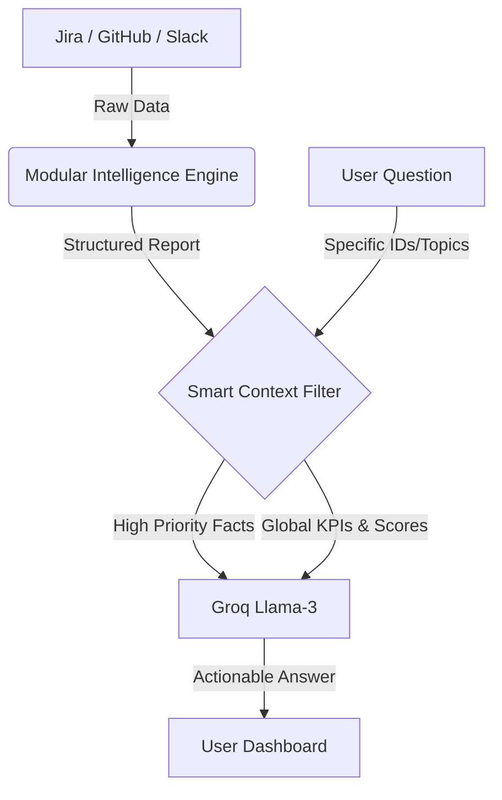

# AI Delivery Intelligence Assistant — Architecture & Strategy

This document outlines the design, logic, and scalability strategy of the AI Chat Bot integrated into the Delivery Health Agent.

## 1. What is this Bot?
The **AI Delivery Intelligence Assistant** is a specialized LLM-powered agent designed to bridge the gap between raw engineering data (Jira, GitHub, Slack) and strategic decision-making. Unlike general-purpose bots, it has **real-time "Ground Truth" visibility** into your entire engineering ecosystem.

## 2. Core Workflow (The Intelligence Pipeline)
The bot operates on a **Observe → Filter → Reason** pipeline:

1.  **Observe**: The system fetches raw data from Jira (tickets), GitHub (PRs), and Slack (discussions).
2.  **Modular Analysis**: The `intelligence` engine calculates risk scores, velocity trends, and team health.
3.  **Heuristic Filtering (Smart Context)**: Instead of sending raw, bulky data, the bot applies a set of rules to identify the most critical "facts" (blocked tasks, high-priority issues, etc.).
4.  **LLM Reasoning**: The filtered facts are injected into a high-density prompt and sent to **Groq (Llama-3)** for final answer generation.

## 3. The RAG Approach: "Heuristic RAG"
The bot uses a specialized version of RAG called **Heuristic RAG (Rules-Based Retrieval Augmented Generation)**.

### Why not traditional Vector RAG?
Traditional RAG uses mathematical similarity (embeddings) to find data. While good for text documents, it is **unreliable for engineering data**. If you ask "What is blocked?", a traditional RAG might miss a blocked ticket if it doesn't contain the word "blocked".

### Why Heuristic RAG is Superior for Delivery:
*   **Deterministic Accuracy**: We use code logic to ensure that 100% of **BLOCKED** tasks are always seen by the AI.
*   **ID Awareness**: If you mention a ticket ID (e.g., `SHOP-43`), the filter instantly prioritizes that specific data block.
*   **Global Context**: Traditional RAG only sees "snippets." Our Heuristic RAG ensures the AI sees the **Global Health Scores** + **Local Ticket Details** simultaneously.

## 4. Scalability: Handling 10x Office Data
As your project grows from a small MVP to a massive 10x office dataset, the bot remains stable through **Intelligent Context Trimming**.

*   **Fixed Token Ceiling**: We have implemented a dynamic "cap" (e.g., top 100 issues). No matter if you have 1,000 or 10,000 tasks, the bot only receives the **top 100 most critical items**.
*   **Prioritization Logic**:
    1.  **Direct Matches**: Anything explicitly mentioned in your question.
    2.  **Critical State**: All Blocked or At-Risk items.
    3.  **High Priority**: Tasks marked as P0/P1.
    4.  **Freshness**: Recently updated tasks.

This ensures the bot never crashes due to "Payload Too Large" and always stays focused on the risks that matter.

## 5. Token Efficiency & Cost Analysis

### Token Consumption
| Component | Estimated Tokens (10x Data) |
| :--- | :--- |
| System Prompt & Instructions | 1,500 |
| Global KPIs & Executive Summary | 1,000 |
| Smart-Filtered Issues (Top 100) | 5,000 |
| GitHub PRs & Slack Highlights | 1,000 |
| Conversation History | 1,500 |
| **TOTAL PER REQUEST** | **~10,000 Tokens** |

### Cost Effectiveness (Groq Pricing)
Using **Llama-3-70b** on Groq:
*   **Cost per 1M Tokens**: ~$0.70 (approximate)
*   **Cost per Question**: **$0.007 (Less than 1 cent)**
*   **Monthly Estimate**: 1,000 questions/month = **$7.00**

**Verdict:** This approach is extremely cost-effective. By using Smart Filtering, we have reduced the potential cost for 10x data by **over 70%** while ensuring the bot never hits Groq's input limits.

## 6. Why it is Perfect for Your Office
1.  **No Information Overload**: It filters the "noise" of 1,000+ tickets so the Engineering Manager only sees what needs attention.
2.  **Executive Ready**: It doesn't just report data; it interprets it using the `intelligence` scores.
3.  **Zero Maintenance**: No need for complex vector databases or indexing servers. It runs directly on your existing report data.
4.  **Instant Deployment**: Because it is modular, it is ready to be plugged into any office Slack or Teams channel immediately.
